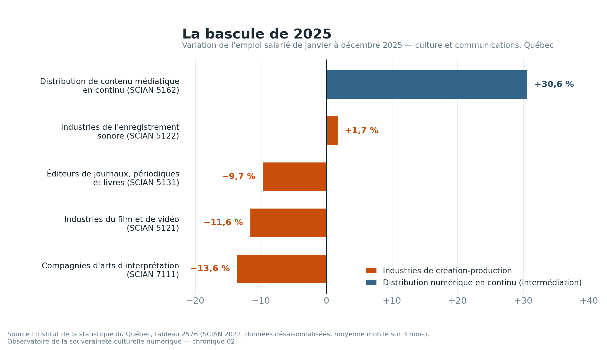
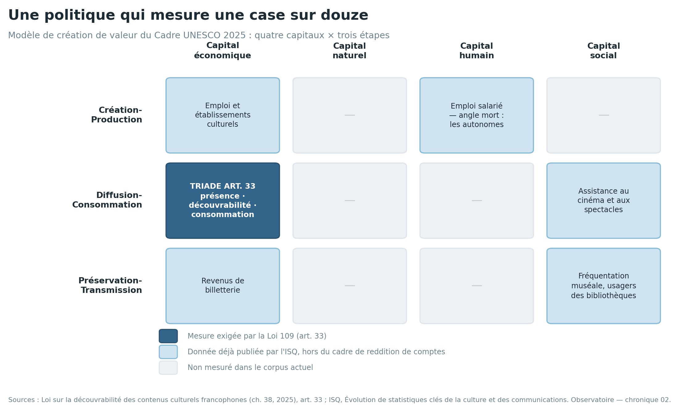
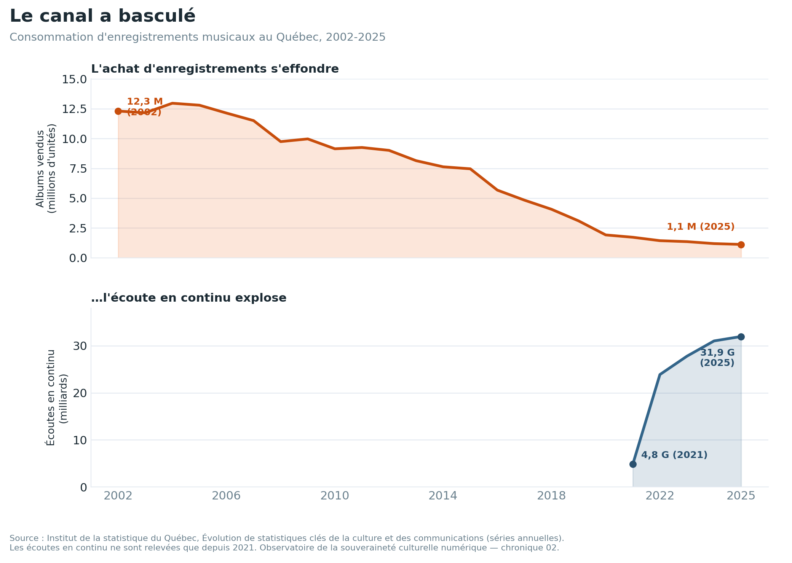

# Les mêmes chiffres, une autre histoire

*Lire la statistique culturelle québécoise à travers le Cadre UNESCO 2025*

Le premier numéro de cet Observatoire reposait sur un chiffre : **6,8 %**, la part des interprètes québécois dans les écoutes en streaming musical. Ce chiffre a été lu dans un seul registre — celui de la consommation. C'est le geste analytique habituel : l'Institut de la statistique du Québec publie un tableau sur la consommation, on en tire un récit de consommation ; il publie un tableau sur l'emploi, on en tire un récit d'emploi. Chaque tableau répond à la question pour laquelle il a été construit, et l'analyse reste à l'intérieur de cette question.

Or le secteur culturel n'est pas bâti ainsi. Il s'étend du patrimoine, qui se mesure sur des échelles séculaires, aux industries formelles, qui suivent des cycles trimestriels ; des créateurs indépendants, qui travaillent hors du cadre salarial, aux intermédiaires numériques, qui opèrent à la vitesse de la machine. Aucun tableau de l'ISQ ne voit l'ensemble. Quand l'analyse reste dans un seul tableau, elle hérite de ses angles morts sans s'en apercevoir.

Cette chronique fait autre chose. Elle reprend des données que l'Observatoire a déjà extraites — les mêmes fichiers, les mêmes chiffres — et les relit à travers une seconde grille. Le pari : **l'écart entre la lecture conventionnelle et la seconde lecture est lui-même un résultat.**

## Le pluralisme méthodologique et le Cadre UNESCO 2025

La seconde grille a un nom et une date. En septembre 2025, à MONDIACULT Barcelone, l'UNESCO a lancé le *Cadre pour les statistiques culturelles 2025* — la première révision majeure de la norme statistique internationale en quinze ans. Ce cadre introduit trois déplacements conceptuels qui importent ici.

D'abord, il remplace la notion d'« industries culturelles » par celle d'**écosystème culturel et créatif** : un périmètre qui compte les intermédiaires numériques — plateformes, algorithmes de recommandation, systèmes d'intelligence artificielle — comme des membres à part entière de l'écosystème, et non comme une perturbation extérieure. Ensuite, il adopte une **lentille praxéologique** : il s'intéresse aux *pratiques* culturelles — qui fait quoi, dans quel rapport aux autres agents — plutôt qu'à la seule taille des industries. Enfin, il actualise le modèle de création de valeur autour de **quatre capitaux** — économique, naturel, humain, social — générés à travers **trois étapes** : Création-Production, Diffusion-Consommation, Préservation-Transmission.

La méthode qui met ce cadre au travail est le **pluralisme méthodologique** : lire les mêmes données à travers plus d'une grille, en posant qu'aucune grille ne capte le tableau complet, et traiter les recadrages entre grilles comme étant eux-mêmes le résultat. C'est une démarche que je développe par ailleurs dans ma pratique de recherche appliquée ; les trois lectures croisées qui suivent en sont l'application au corpus québécois.

## Première lecture : l'écosystème bascule vers l'intermédiaire

Le tableau 2576 de l'ISQ recense l'emploi salarié dans certaines industries de la culture et des communications (classification SCIAN 2022, données désaisonnalisées, moyenne mobile sur trois mois). Lu de façon conventionnelle, ligne par ligne, il donne à voir des fluctuations ordinaires. Lu comme un écosystème, une ligne se détache d'une autre.

Sur les douze mois de 2025, l'emploi salarié dans les *Industries du film et de vidéo* (SCIAN 5121) passe de 15 590 à 13 783 — une variation de **−11,6 %**. Les *Compagnies d'arts d'interprétation* (7111) passent de 4 041 à 3 490 — **−13,6 %**. Les *Éditeurs de journaux, de périodiques et de livres* (5131) reculent de **−9,7 %**. Ce sont des lignes de création-production.

Sur les mêmes douze mois, les *Services de distribution de contenu médiatique diffusé en continu* (SCIAN 5162) passent de 1 620 à 2 116 — une variation de **+30,6 %**. C'est une ligne d'intermédiation.

La lecture conventionnelle range ces variations dans des cellules distinctes d'un tableau intitulé « emploi ». La lecture écosystémique les relie : en une seule année, la main-d'œuvre culturelle québécoise se contracte là où le contenu est *créé* et s'étend là où il est *distribué en continu*. Et elle relie ce constat au chiffre du premier numéro : la main-d'œuvre migre vers la distribution algorithmique au moment précis où la part québécoise s'effondre sur les canaux algorithmiques — 6,8 % en streaming contre 19,6 % sur les albums numériques téléchargés. Le même phénomène structurel — l'intermédiation algorithmique — affleure dans deux tableaux de l'ISQ que rien, dans la lecture conventionnelle, n'invite à mettre côte à côte.

## Deuxième lecture : la Loi 109 mesure un capital sur quatre

L'article 33 de la *Loi sur la découvrabilité des contenus culturels francophones dans l'environnement numérique* oblige le ministre à faire rapport, tous les trois ans, sur trois objets : la **présence**, la **découvrabilité** et la **consommation** des contenus. Le premier numéro de l'Observatoire a utilisé cette triade comme charpente ; celui-ci l'interroge.

Le Cadre UNESCO 2025 reconnaît quatre capitaux que l'activité culturelle génère : économique, naturel, humain et social. Plaçons la triade de l'article 33 en regard. Présence, découvrabilité et consommation sont toutes trois des mesures tournées vers le marché — elles décrivent si un contenu existe dans l'environnement numérique, s'il peut y être repéré, et s'il y est effectivement consommé. Dans le vocabulaire du cadre, elles relèvent presque entièrement du **capital économique** et de ses antécédents immédiats. Où, dans le rapport triennal, figure le **capital humain** — la transmission du métier, la formation et le renouvellement des créateurs ? Où figure le **capital social** — la participation culturelle, la cohésion qu'une vie culturelle partagée produit ?

Le constat est plus précis qu'un grief général, parce que l'ISQ publie déjà les données manquantes. Sa série *Évolution de statistiques clés de la culture et des communications* suit la fréquentation des institutions muséales (13,3 millions d'entrées en 2024), les usagers inscrits dans les bibliothèques publiques (2,6 millions en 2023), l'assistance aux représentations payantes des arts de la scène (9,1 millions en 2024) — autant d'indicateurs d'étape Préservation-Transmission et de participation sociale, tous disponibles, tous hors du cadre de reddition de comptes de l'article 33. **L'angle mort n'est pas un manque de données. C'est un choix de cadre.** Une politique de découvrabilité peut, sur cette charpente, faire état d'un succès sur la consommation tout en restant muette sur le renouvellement de la capacité créative qui produit les contenus à découvrir — et la première lecture vient de montrer cette capacité reculer de plus de dix pour cent en une année.

## Troisième lecture : la lentille praxéologique et les créateurs invisibles

Le cadre statistique de 2009 comptait des industries : établissements, emplois, dépenses. Le Cadre 2025 demande plutôt qui exerce quelle pratique culturelle. Ce déplacement a une conséquence concrète pour les données québécoises.

Le tableau 2576 — celui sur lequel s'appuie la première lecture — mesure l'emploi *salarié*. Sa note méthodologique est explicite : il s'appuie sur l'Enquête sur l'emploi, la rémunération et les heures de travail (EERH), construite à partir des relevés T4, et il exclut donc les travailleurs autonomes. En musique comme en cinéma, cette exclusion n'est pas marginale. Une part importante des personnes qui font réellement le contenu — musiciens indépendants, réalisatrices et réalisateurs à la pige, instrumentistes de séance, créateurs autoproduits — travaillent précisément hors du cadre salarial.

L'instrument que l'Observatoire a mobilisé pour mesurer l'écosystème de production ne voit donc pas une large part de la pratique que la Loi 109 entend protéger. La lecture conventionnelle signale ce fait comme une « limite connue », en note de bas de page. La lentille praxéologique refuse la note de bas de page : lorsque l'instrument statistique exclut par construction les praticiens que vise la politique, ce n'est pas une réserve sur le résultat — cela redéfinit ce que le résultat peut affirmer. Le −11,6 % de la première lecture est réel, mais il décrit la portion *salariée* d'un écosystème dont le noyau créatif est largement autonome, et largement non mesuré.

## Ce que le pluralisme change pour la Loi 109

Trois implications, qu'aucune lecture mono-tableau ne fait apparaître.

D'abord, la triade de reddition de comptes de l'article 33 gagnerait à être lue en regard des quatre capitaux. Le rapport triennal du ministre — attendu pour la fin de 2028 — pourrait, sans aucune collecte nouvelle, situer présence, découvrabilité et consommation aux côtés des indicateurs de capital humain et de capital social que l'ISQ produit déjà. Le cadre en donne la permission conceptuelle ; les données existent.

Ensuite, l'angle mort de l'EERH signifie que la présence et la consommation se laissent suivre avec les instruments actuels, mais que **la santé de l'écosystème de production, elle, ne se laisse pas suivre** — pas à partir du seul tableau 2576. Mesurer le noyau créatif exige des instruments qui voient le travail culturel autonome. C'est un point d'agenda concret, non une figure de style.

Enfin, les recommandations 25 et 26 du Comité-conseil sur la découvrabilité (2024), sur le partage des données d'usage par les plateformes, gagnent un corollaire. Avant même que les plateformes n'ouvrent leurs journaux, la lecture croisée des tableaux publics de l'ISQ produit déjà des résultats que la lecture tableau par tableau laisse échapper. Le pluralisme méthodologique est une discipline disponible maintenant, avec le corpus déjà en main.

## Une limite à nommer

Le pluralisme méthodologique n'affirme pas que les lectures conventionnelles sont fausses. Le 6,8 % est exact selon la méthodologie de l'Observatoire de la culture et des communications du Québec ; le −11,6 % est exact selon celle de l'EERH. Chaque lecture mono-tableau est juste à l'intérieur de son cadre. Le pluralisme pose une affirmation plus étroite et plus défendable : les lectures mono-tableau manqueront *systématiquement* certains motifs — les phénomènes structurels qui traversent plusieurs tableaux, les déséquilibres entre capitaux, les pratiques qu'un instrument ne couvre pas — et seule la lecture multi-grille les résout.

Et la seconde grille est elle-même jeune. Le Cadre 2025 a été lancé il y a huit mois ; les organismes statistiques nationaux, l'ISQ compris, mettront des années à y migrer leurs systèmes. Cette chronique n'attend pas cette migration. Elle applique dès maintenant la structure conceptuelle du cadre, dans l'intervalle — ce qui est exactement la position qu'occupe la Loi 109 elle-même : une politique de souveraineté culturelle adoptée avant que l'appareil statistique capable d'en mesurer pleinement les effets ne soit en place. Relire les données existantes de façon plus plurielle est, pour l'instant, l'instrument le plus honnête dont on dispose.

---

*Cette chronique est le deuxième numéro de l'Observatoire de la souveraineté culturelle numérique. Le tableau de bord empirique et le pipeline de transformation des données ISQ sont publiés en accompagnement. La méthode du pluralisme méthodologique mobilisée ici est articulée plus largement dans le* Atana FCS Consulting Playbook *(J. Roque, mai 2026).*
